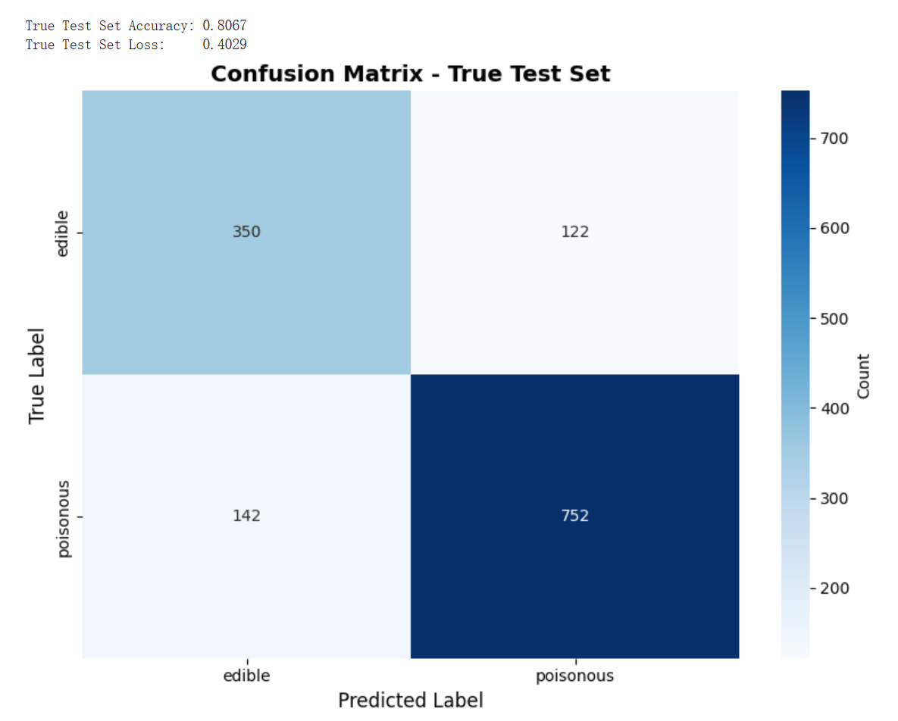

```
======================================================================
UVA 4774 final project team 30 : Detecting poisonous mushrooms using machine learning techniques.

Ruixin Duan Jinghan Zhang Isabella Liu

12/17/2025
======================================================================
```

## Overview
In this repository, we prepare everything that is needed to reproduce our results for the final project of CS4774 machine learning. In this project, we try to classify mushrooms into edible or poisonous with a focus on less false edible. Our goal is to build models that could predict the class of the mushrooms with 75% recall or above. To achieve that goal, we collected multiple datasets and train baseline CNN model and MobileNet model.

## Usage:
To run our code and get the results, make sure that you changed the directory of the dataprocessing.ipynb to your working directory. After processing the code, run other scripts to build models and see results.

## Setup:
The setup needed for this project can be done follow:

step 1: Install python of version 3.9-3.11. Run python --version to see if the version is proper.

step 2: Install dependencies: pip install -r requirements.txt


## Link to the video
 final presentation
https://youtu.be/5bpg49MUFBY


## Links to our data
https://www.kaggle.com/datasets/quanghn2001/image-mushroom-dataset?resource=download

https://www.kaggle.com/datasets/marcosvolpato/edible-and-poisonous-fungi/data

## Link to our slides 
https://www.canva.com/design/DAG5ecEw8XE/YwEtQcNrUhZ7R1tbytkU7Q/edit

## Problem/Topic
Identify whether a mushroom picture is toxic or edible.

## Project structure

```text
├── LICENSE.md           # MIT License
├── README.md          # Brief description about the project and the project structure.
├── team-30             # Contain all the scripts and data needed.
│         ├── src             # The subfolder that contains all the scripts we needed.
│           ├── DataProcessing.ipynb     # The code for data cleaning preprocessing, combining into a single dataset.
│           └── CNN.ipynb     # Our coding for CNN model.
|            └── Mobile.ipynb   # Our coding for MobileNet model.
|         ├── DATA
│           ├── original_data         # The subfolder that contained all the original data
|                  └──.......
│           └── Cleaned # The subfolder that contains all the cleaned combined data.
|                  └── Train.CSV
|                  └── Test.csv


```
## Project Motivation
There are many mushroom poisoning outbreaks because people can’t tell whether a mushroom is toxic. As a result we were interested in exploring how far a relatively simple convolutional neural network (CNN) or/and MLP can go in performing a task realted to plant species detection. 
Our motivation is to apply what we have learned in machine learning to address a meaningful real-world challenge. 
Worldwide, hundreds of people die each year from wild mushroom poisoning, and experts believe the actual number is higher due to underreporting. We think that this is because human visual identification is unreliable. So maybe machines can be trained on thousands of samples and give more accurate results.

## Result Analysis
Before optimization: simple CNN logic with 3 convolution layers performs a 48% accuracy rate overall.
Below is the statistics for training data: 

CNN gets about 78% accuracy on 513 images. The data is imbalanced, because there are 376 poisonous and only 137 edible samples, so accuracy can look better than it really is.
The model is much better at recognizing “poisonous” than “edible”.
It has 0.88 recall for poisonous, which means it correctly finds most poisonous mushrooms.

After optimization: we get to an accuracy rate around 58%. There is improvement but not a lot.

The final validation accuracy is 0.9045 (about 90%) on 513 images.
The confusion matrix:
105 edible were correctly predicted as edible.
32 edible were wrongly predicted as poisonous.
17 poisonous were wrongly predicted as edible.
359 poisonous were correctly predicted as poisonous.

Note:
The red dashed line marks the moment when the model changed the training strategy.
It is at epoch 15 because it decided to start fine-tuning after 15 epochs.

Before epoch 15, the usual setup is:
MobileNetV2 is used as a fixed feature extractor. The base MobileNetV2 layers are frozen, so their weights do not change.
And this phase helps the new classifier learn to use the general features that MobileNetV2 already knows.
After epoch 15, fine-tuning unfreezes some top MobileNetV2 layers. Train again, update the base model weight. 
By comparing our testing set result and the training set result, we think there maybe a overfitting because the actual accuracy rate is much lower.

Later on, we adjusted the datasets to add more images to the training set: We added an additional data set downloaded from kaggle to the model. Because in the presentation, Prof Qi said there is actually an underfitting, we try to make the model learn over more images to improve the accuracy rates for the testing set.
Here is the result:
We end up with a Final validation accuracy: 0.7088
Final validation loss: 0.5469 for CNN models and for MobileNetV2, a Final validation accuracy: 0.8288
Final validation loss: 0.3740. while the True Test Set Accuracy: 0.8067 True Test Set Loss: 0.4029. This is a huge improvement. 
We could tell from the graphs there is less overfitting and underfitting. Also there is 

For poisonous mushrooms, the model catches 752 out of 894 poisonous, so the poisonous recall is about 84%.
The model misses 142 out of 894 poisonous, so about 16% of poisonous are predicted as edible.
For edible mushrooms, the model correctly identifies 350 out of 472 edible, so edible recall is about 74%.
The model rejects 122 out of 472 edible by calling them poisonous.
This model is reasonably accurate overall but still not very good.

## Difficulties
Our model used to stuck at an accuracy rate of around 60%, which is not very good. Issues: There are biased/ insufficient data sets and an underfitting. The model cannot reach the optimum and we have a great gap between the training set and the testing set. 
In addition, the testing set is very different from the training set. Maybe that is the problem why we obtain a lower result than we originally expected it to have.
